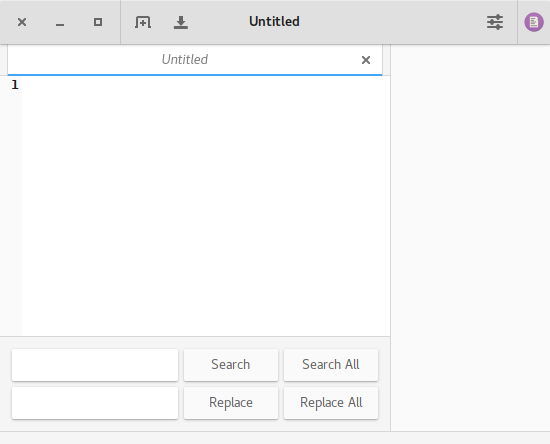

# Code

Code is a simple code editor for GNU/Linux.

## Version

This project follows the semantic versioning system and still hasn't reached its first major release.

## Contributing

If you plan to contribute, check `DESIGN.md` and `CONTRIBUTING.md`.

## Notable Planned Features

Some of these features are more likely to happen than others. This list

- Tree view:
  - Add or remove folders from tree view (bookmark behavior).
  - Integration with `git`.
- Session manager:
  - Store session when closing and restoring when starting.
  - Part of a session: open tabs and tree view.
- Graphical integration with `git`:
  - Make commits and create or delete branches.
  - Add tags.
  - Checkout and rebase.
  - Push and pull from remote repositories.
  - Log graph.
- Editor:
  - Word completion (with words from the same file and other open files).
  - Search and replace (in same file, files open or all files in the tree view) with support for regular expressions.
- Preferences:
  - Select highlight theme.
  - Built-in hightlight theme editor.
  - Backup system (simple and with `git`).

## License

This program is licensed under GPL version 3:

Copyright © 2017 Felipe Ferreira da Silva <ferreiradaselva@protonmail.com>

This program is free software: you can redistribute it and/or modify
it under the terms of the GNU General Public License as published by
the Free Software Foundation, either version 3 of the License, or
(at your option) any later version.

This program is distributed in the hope that it will be useful,
but WITHOUT ANY WARRANTY; without even the implied warranty of
MERCHANTABILITY or FITNESS FOR A PARTICULAR PURPOSE.  See the
GNU General Public License for more details.

You should have received a copy of the GNU General Public License
along with this program.  If not, see <http://www.gnu.org/licenses/>.
